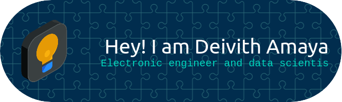

  

Ingeniero Electrónico y científico de datos junior con mucha pasión hacia las matemáticas, la estadística, el aprendizaje de máquina y el pensamiento crítico. Mis habilidades son la planificación-organización, creatividad, adaptabilidad y mejoramiento continuo.

*   🌍  Estoy en Bogotà Colombia
*   ✉️  Me puedes contactar a [amayadeivith@gmail.com](mailto:amayadeivith@gmail.com)
*   🧠  Estoy aprendiendo Programa especializado: Machine Learning e Ingles

### Skills 

    
  
  
                    

    

### Badges

<b>Top Repositories</b>

   

### Socials

 <a href="https://www.github.com/deivithamaya" target="_blank" rel="noreferrer"> <picture> <source media="(prefers-color-scheme: dark)" srcset="https://raw.githubusercontent.com/danielcranney/readme-generator/main/public/icons/socials/github-dark.svg" /> <source media="(prefers-color-scheme: light)" srcset="https://raw.githubusercontent.com/danielcranney/readme-generator/main/public/icons/socials/github.svg" />  </picture> </a> <a href="https://www.linkedin.com/in/deivith-amaya-3378b7154" target="_blank" rel="noreferrer"> <picture> <source media="(prefers-color-scheme: dark)" srcset="https://raw.githubusercontent.com/danielcranney/readme-generator/main/public/icons/socials/linkedin-dark.svg" /> <source media="(prefers-color-scheme: light)" srcset="https://raw.githubusercontent.com/danielcranney/readme-generator/main/public/icons/socials/linkedin.svg" />  </picture> </a>

  

